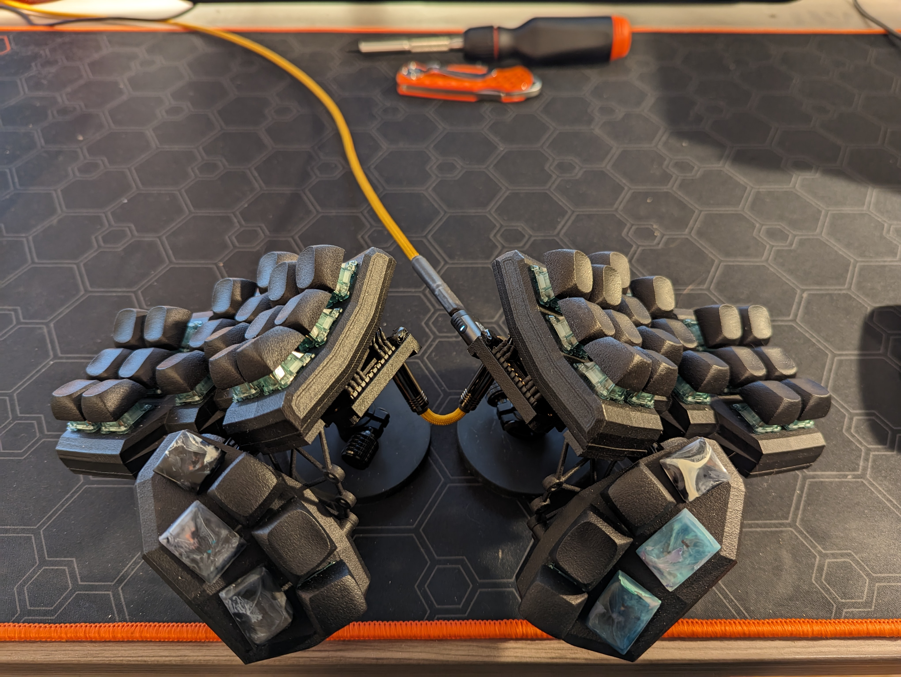

# Explorer Pi Keyboard V2

## Introduction 

The Explorer Pi is a cusomized version of the [Explorer Keyboard RxCT](https://github.com/DreaM117er/Explorer-Keyboard-RxCT/tree/main) designd by [DreaM117er](https://github.com/DreaM117er/). 

It's been fitted to my personal ergomomic preferences and some of the originals modualrity has been sacraficed for easier assembly and increased sturdiness. In particular the thumb cluster has been improved with a two piece (top and bottom) design that is much sturdier and has tighter spacing between keys. Additionally any of the thumb cluster keys can be either MX or Choc key switches and this can be changed relatively easily after the fact. 

## Features 
- Thumb cluster with adjustable angles
- MX or choc keyswites an thumb cluster
- Entire thumb cluster is modular (wiring included) and could be easily swapped for a different design
- 1/4" mounting with ARRI locating holes
