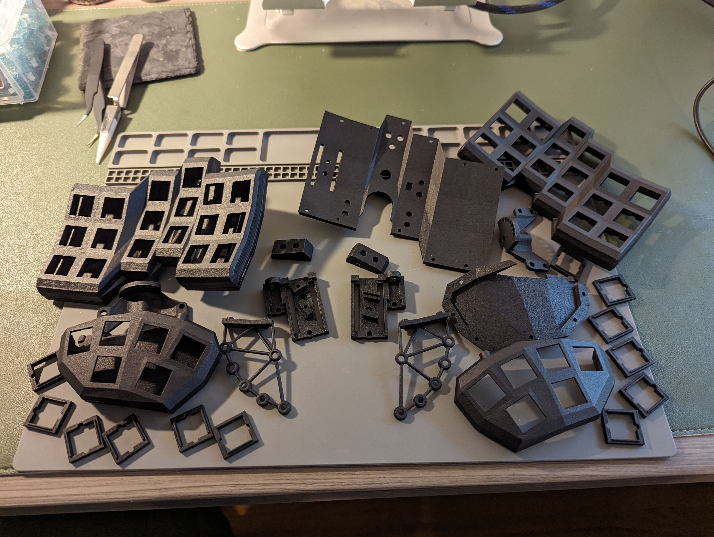
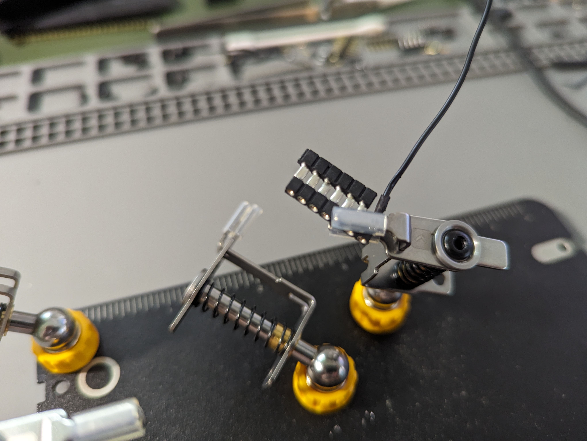
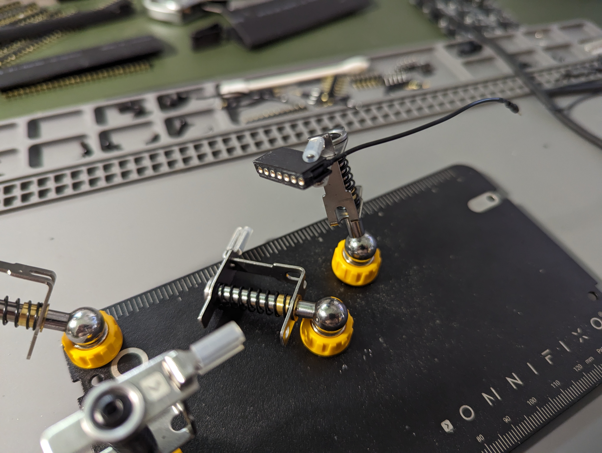
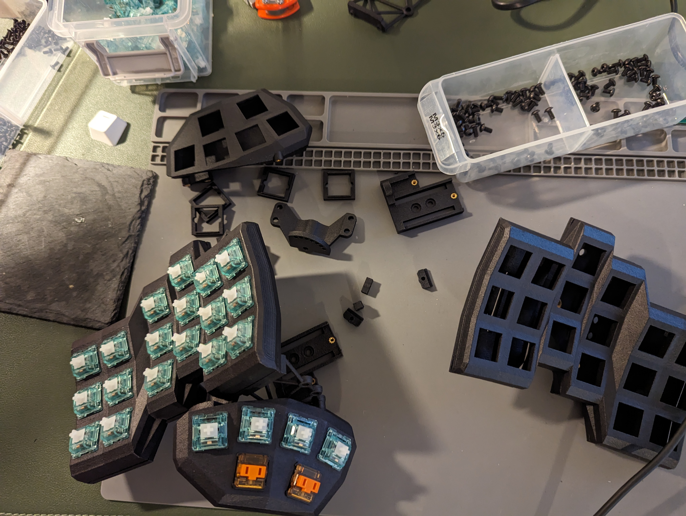
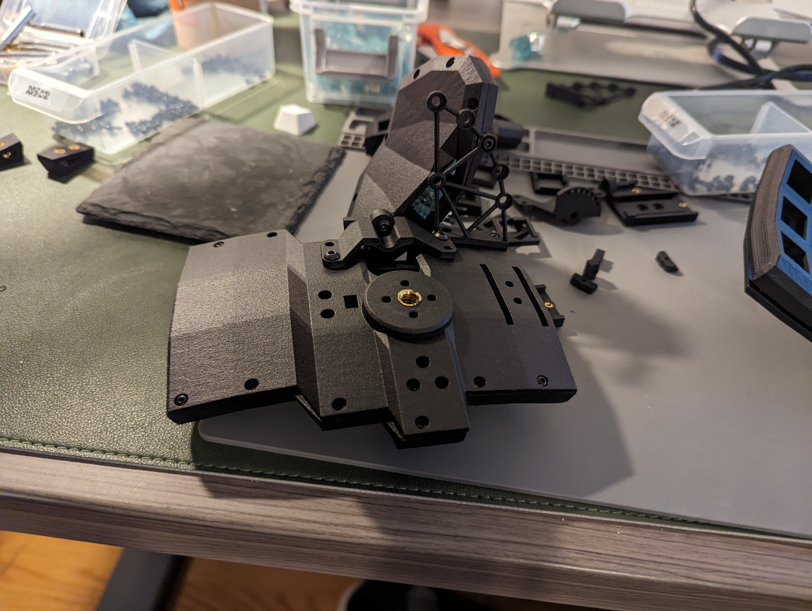
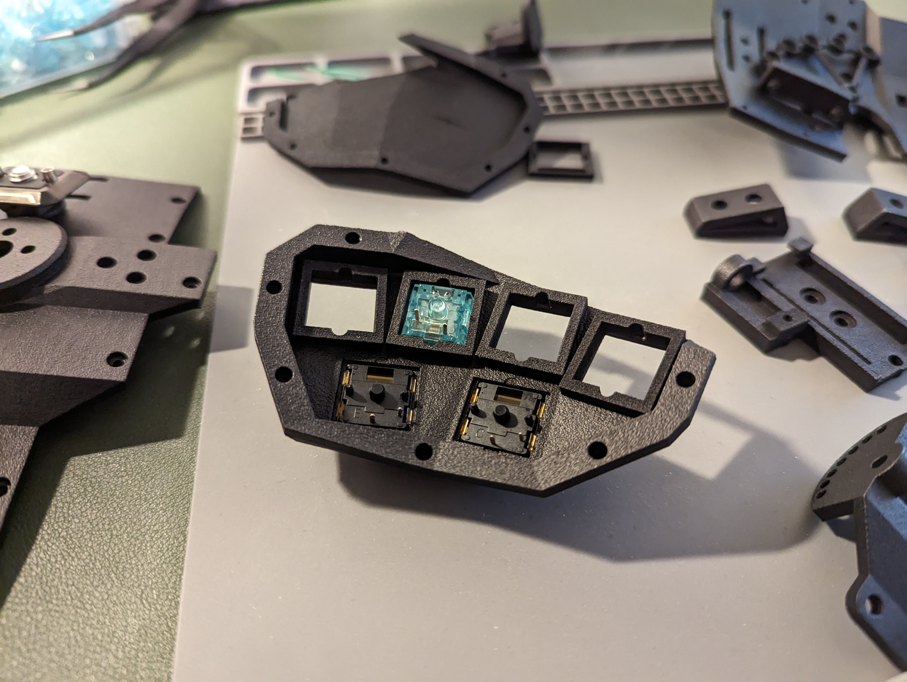
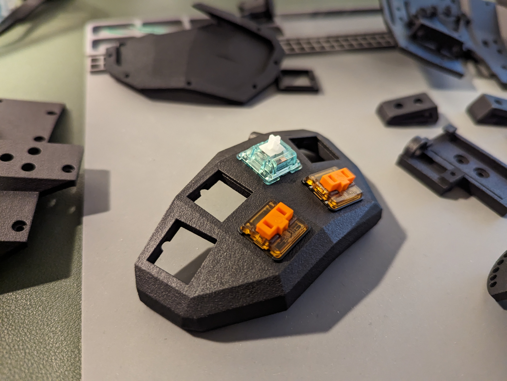

# Build Guide

TBD with V3

## Build Tips

- The desired thumb cluster angle needs to be set before final assembly. Adjusting after the fact is achivable with some difficulty without assembly or by detaching the thumb cluster attachement from the base, though depending on how you have wired things this may be more or less difficult
  - You could leave out the M2 screw that sets the angle on attachement point and rely on the strut to provide a second point of attachement if you wish. It will be less secure but let you adjust the thumb cluster angle with ease.
- Don't wire direct from mcu to the keys. Wire from the mcu to a manifold/male-female extension attached to the base. Then attach from manifold to top/thumb cluster, preferably in a detachable/reattachable manner. I use machine pins and silicone wire to create custom cables.
- Use flexible silicone with 28 or 30 awg wire, especilly in any connections thas will run between detachable parts. Using non-flexible wire will make assembly a pain and prone to breaking. Ask me how I know. 
- [Flexible pcb columns](https://skree.us/products/dactyl-compatible-flexible-row-pcbs-populated) can help simply your build if you are willing to pay for them. I've tested these ones from Skree for compatablity. 

## Pictures

