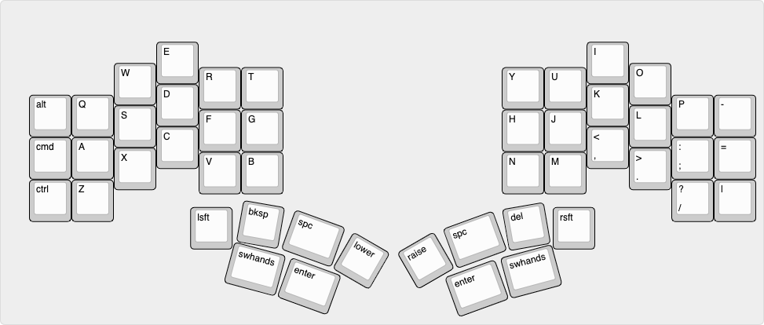

# Files

## explorer-pi-layout-template.json

This json is for [Keyboard Layout Editor](http://www.keyboard-layout-editor.com/#/gists/f90687ef3c709af049c13a0a4d5b263d) and is meant to serve as a starting point for your own layer reference. 

## explorer-pi-layout-template.png 
Example of what the editor will generate given template json

