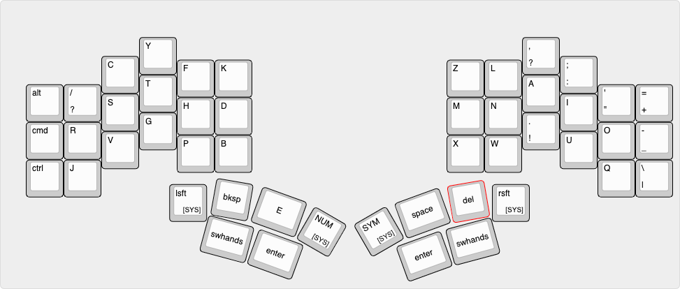
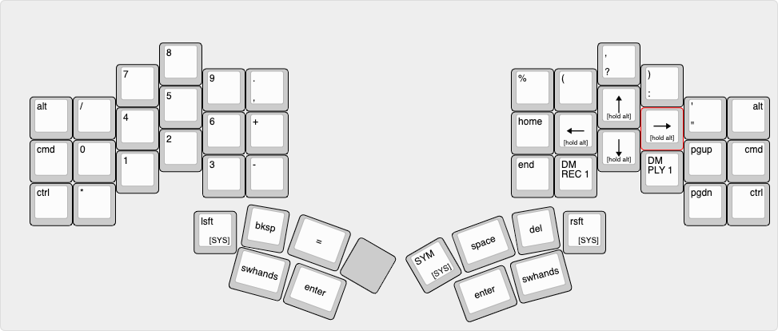
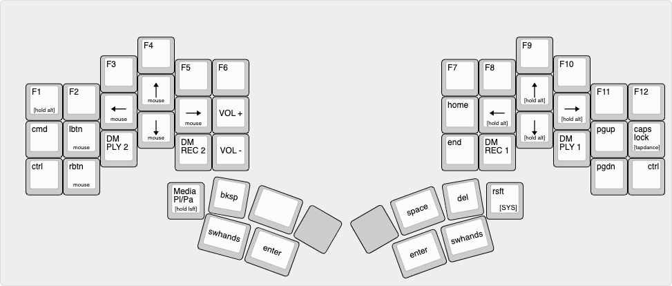

# Layout

Personal layout reference, generated by [Keyboard Layout Editor](http://www.keyboard-layout-editor.com/#/gists/f90687ef3c709af049c13a0a4d5b263d)

Firmware: [Explorer PI QMK Firmware (fork)](https://github.com/mroukema/qmk_firmware/tree/explorer_pi_v2/keyboards/explorer_pi/3x6_6)

## Idle Timeout
Layout features an idle timeout feature that will return the keyboard to the default layer, in this case RSHTD. This will trigger if on any non-default layer and `TIMEOUT_TO_DEFAULT_LAYER` ms have elapsed since last keyboard input. This feature is disabled if `TIMEOUT_TO_DEFAULT_LAYER` is undefined.

```C
#define TIMEOUT_TO_DEFAULT_LAYER 1000 * 60 * 3 // 3mins
```

## Combos

All combos evaluated relative to RSTHD layer regardless of acive layer as a result of below option being used:

```C
#define COMBO_ONLY_FROM_LAYER 0
```

- Alt + C               = TAB
- Alt + S               = ESC
- O + U                 = "OU"
- Q + U                 = "QU"
- Left + Right Shift    = Momentary System Layer
- Num + Sym             = Momentary System Layer
- Swap Hands + Shift    = Momentary System Layer
- Cmd + Minus           = Return to RSTHD Layer
  
## RSTHD (default)



## Numpad



## Symbol 


## System

