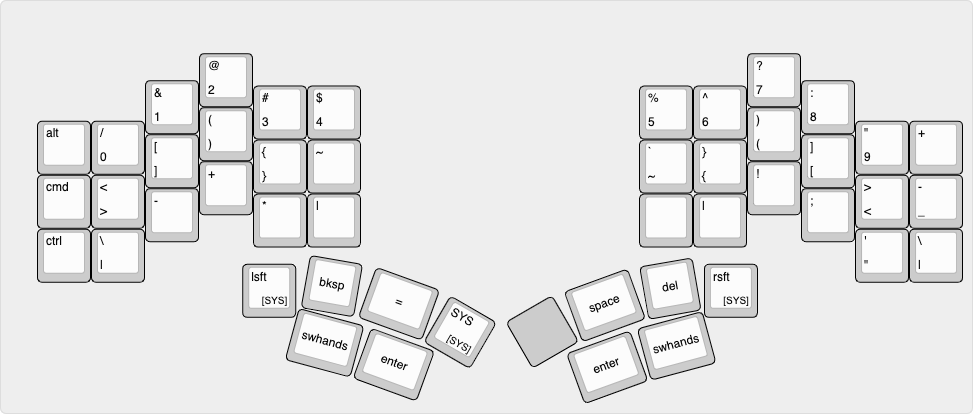

# Layout

Personal layout reference, generated by [Keyboard Layout Editor](http://www.keyboard-layout-editor.com/#/gists/f90687ef3c709af049c13a0a4d5b263d)

Firmware: [Explorer PI QMK Firmware (fork)](https://github.com/mroukema/qmk_firmware/tree/explorer_pi_v2/keyboards/explorer_pi/3x6_6)

## RSTHD (default)

## Numpad

## Symbol 

## System

